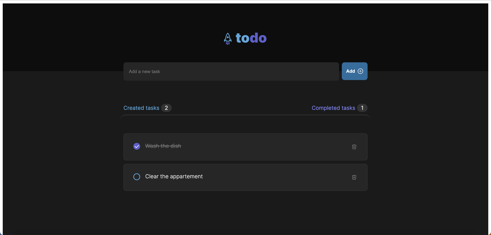

# To-do list

 ###  1. Ways of compiling the project
     There are 3 ways of compiling the project:
     `npm run dev` - Webpack will compile the project for development
     `npm run build` - Webpack will compile the project for production
     `npm run start` - Webpack will compile the project using the Live Server
